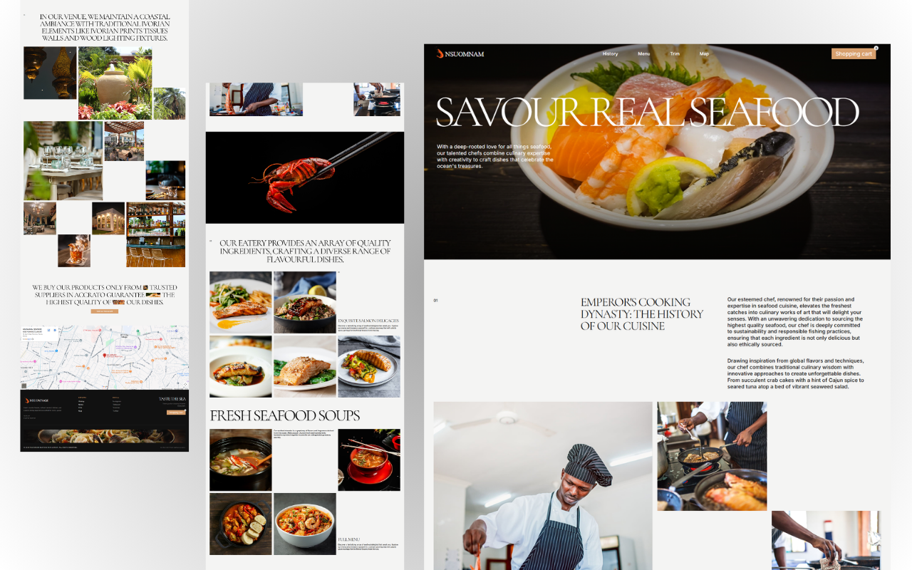

# NSUOMNAM — Seafood Restaurant Landing Page

A multi-section restaurant marketing site built with React and Tailwind CSS. Designed around a West African seafood brand, the layout prioritizes food photography, sourcing narrative, and in-venue ambiance storytelling.

## Live Demo

<a href="https://deluxe-sorbet-645d94.netlify.app/" target="_blank">
  
</a>

---

## Tech Stack

<p align="left">
  
  
  
  
</p>

---

## Features

- **Full-bleed hero** — Large typographic heading over high-quality food photography
- **Brand narrative section** — Cooking dynasty history and cuisine origin storytelling
- **Ingredient showcase** — Multi-column photography grid highlighting quality ingredients
- **Dish gallery** — Dedicated sections for signature dishes and fresh seafood soups
- **Ambiance gallery** — Coastal Ivorian interior decor and venue photography grid
- **Supplier trust section** — Sourcing transparency with visual layout
- **Google Maps integration** — Embedded location map in the footer
- **Fully responsive** — Optimized layout across desktop, tablet, and mobile

---

## Getting Started

```bash
# Clone the repository
git clone https://github.com/NSniha/seafood-restaurant-landing.git

# Navigate into the project
cd seafood-restaurant-landing

# Install dependencies
npm install

# Start the development server
npm run dev
```

Open [http://localhost:5173](http://localhost:5173) in your browser.

---

## Project Structure

```
seafood-restaurant-landing/
├── public/
│   └── assets/
├── src/
│   ├── components/
│   ├── App.jsx
│   └── main.jsx
├── index.html
├── package.json
├── tailwind.config.js
└── vite.config.js
```

---

## Use This as a Template

This project is a clean reference for:
- Restaurant or food business landing pages
- Multi-section marketing sites with photography grids
- React + Tailwind CSS UI layout patterns
- Vite project structure for frontend developers

Feel free to fork and customize for your own projects.

---

## License

[MIT](LICENSE) — free to use, modify, and distribute.

---

Built by [NSniha](https://github.com/NSniha)
